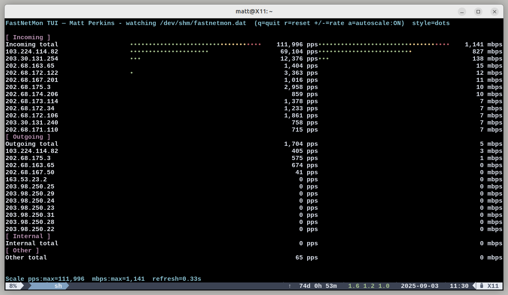

# fastnetmon_tui

A curses TUI that visualises [FastNetMon](https://fastnetmon.com/) CLI statistics in real time as colour VU-style Unicode bar graphs.  
It parses the FastNetMon stats file (default `/tmp/fastnetmon.dat` or path configured in `/etc/fastnetmon.conf`) and displays **pps** and **mbps** per section/IP.  
Flows are ignored.

 <!-- optional screenshot -->

---

## Features

- Live, auto-refreshing view of FastNetMon traffic stats
- Unicode **dot** (`•`, default) or **block** (`█`) bar graphs
- Colour gradient bars: green → yellow → red as utilisation increases
- Section totals and per-IP breakdown for:
  - Incoming
  - Outgoing
  - Internal
  - Other
- Auto-scaling with peak decay, or manual reset
- Keybindings for quitting, rescaling, and adjusting refresh rate
- Reads stats file location automatically from `/etc/fastnetmon.conf` (`cli_stats_file_path`)  

---

## Installation

Clone this repo and run the script with Python 3.  
Requires a terminal with curses and colour support (e.g. `xterm-256color`, tmux, screen, SSH is fine).

```bash
git clone https://github.com/youruser/fastnetmon_tui.git
cd fastnetmon_tui
python3 fastnetmon_tui

## Todo

IPv6 support 
